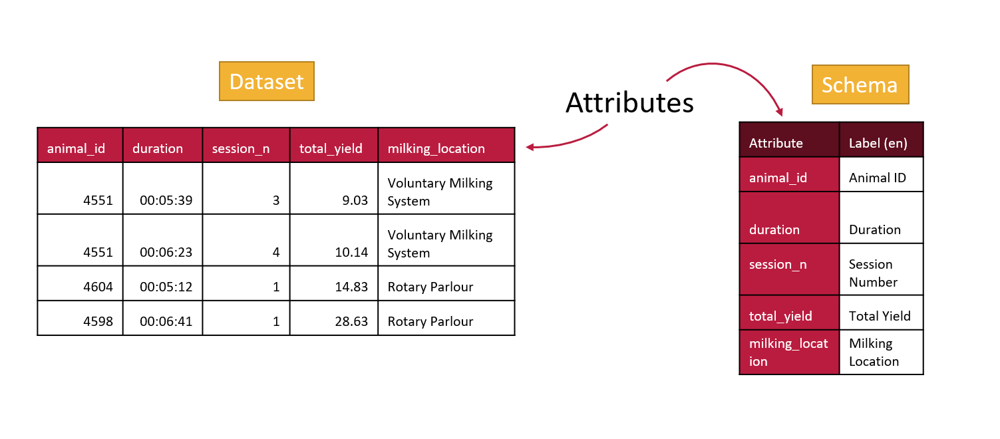

# Data Schemas

A schema describes the structure of the data. A good schema will tell you what the column labels are and what they mean. It will tell you the units and it will tell you what type of data is in each column.

To help you understand and use the data you need a well documented data schema. 

Better data schemas aid researchers in sharing data with the research community. Better documentation enables researchers to effectively communicate the context of the data to other users, ensuring that the information is used accurately. This is especially valuable in cross-disciplinary research where other users are less familiar with the conventions of a particular discipline.

Formalized, machine-readable schemas are very useful and can be expressed in a number of languages including Link-ML, Overlays Capture Architecture (OCA), JSON Schema, XML Schema Definition, and JSON-LD. Different schema languages have different benefits but the biggest advantage of using any schema language to document a schema is that the schema is documented and in a machine-readable format.

With a machine-readable schema you can use it for many other tasks including data verification, data entry and data harmonization. For example, the [Semantic Engine](https://www.semanticengine.org) helps researchers write their own data schemas using the OCA schema language. The [Data Harmonizer](https://github.com/cidgoh/DataHarmonizer) uses custom Link-ML schemas to let researchers verify their data according to the Link-ML schema.

- written by Carly Huitema