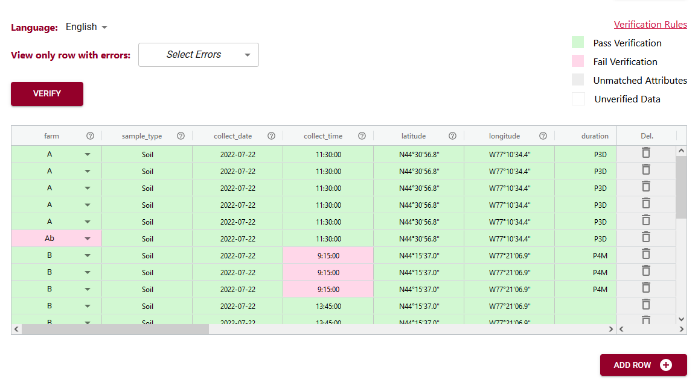

# Write a schema
{: .no_toc }

## Table of Contents
{: .no_toc .text-delta }

1. TOC
{:toc}

All datasets have a schema, either implicit or explicit. The goal of the Semantic Engine is to take your knowledge of the data and document that explicitly using a schema. 

To easily write machine-readable schemas in the OCA schema language, the organization Agri-food Data Canada from the University of Guelph has developed a friendly user-interface for documenting data and using the schemas that have been generated.

## Using the Semantic Engine

The [Semantic Engine](https://www.semanticengine.org) has been developed to be a self-directed site for researchers to document any table-based research data. Throughout the site there is helpful documentation as well as a [tutorial webpage](https://agrifooddatacanada.github.io/OCA_Composer_help_pages/en/TutorialAll/). 

<iframe width="560" height="315" src="https://www.youtube.com/embed/ekMmpx_w45M?si=fZKfGS9Z7QEexCb5" title="YouTube video player" frameborder="0" allow="accelerometer; autoplay; clipboard-write; encrypted-media; gyroscope; picture-in-picture; web-share" referrerpolicy="strict-origin-when-cross-origin" allowfullscreen></iframe>

## Use a Schema

### Create a Data Entry Excel

On the [Semantic Engine](https://www.semanticengine.org) website you can use the machine-readable version of your schema to generate a Excel sheet that has been prefilled according to the rules of the schema and ready for data entry.

When you open your Data Entry Excel you will see it consists of two sheets, one for schema description and one for the entry for data. The schema description sheets takes information from the schema that was uploaded and puts it into an information table.

### Verify data in a web browser

You can use your schema to enter and verify data using your web browser.

The Data Entry Web tool of the [Semantic Engine](https://www.semanticengine.org) lets you upload your schema and then you can optionally upload a dataset. If you choose to upload a dataset, remember the Semantic Engine tool never receive your data. Instead, your data is ‘uploaded’ into your browser and all the data processing happens locally.

If you don’t want to upload a dataset, you can skip this step and go right to the end where you can enter and verify your data in the web browser. You add rows of blank data using the ‘Add rows’ button at the bottom and then enter the data. You can hover over the ?’s to see what data is expected, or click on the ‘verification rules’ to see the schema again to help you enter your data.

### Save your data together with your schema

Store your schema multiple ways.

1. Store a schema with your dataset and share it when you share your data.
2. Share a schema with your lab or collaborators by storing it in a shared lab drive.
3. Store your schema as an independent object in a repository such as Borealis or Zenodo.

Store the machine-readable schema bundle version and the .txt human-readable version together for best usability.

- written by Carly Huitema