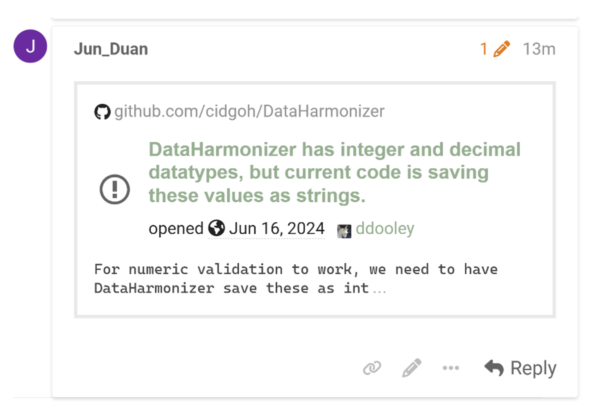
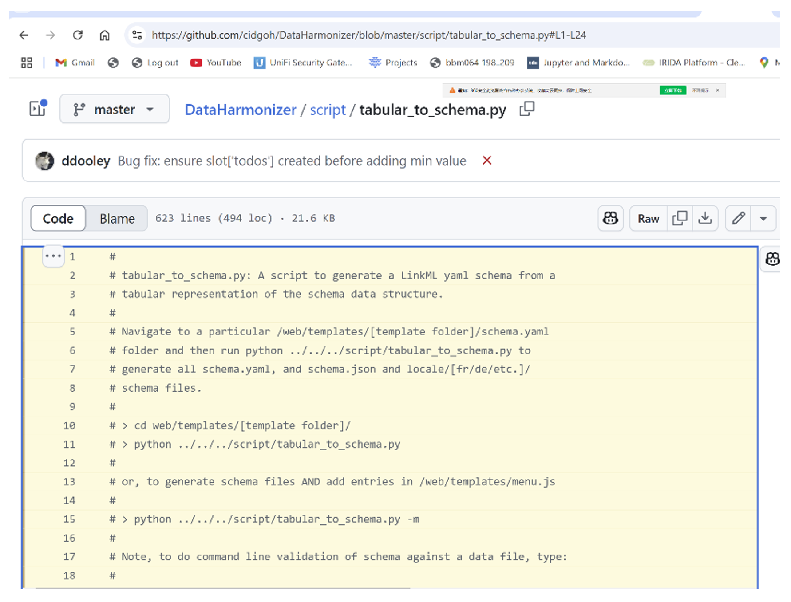
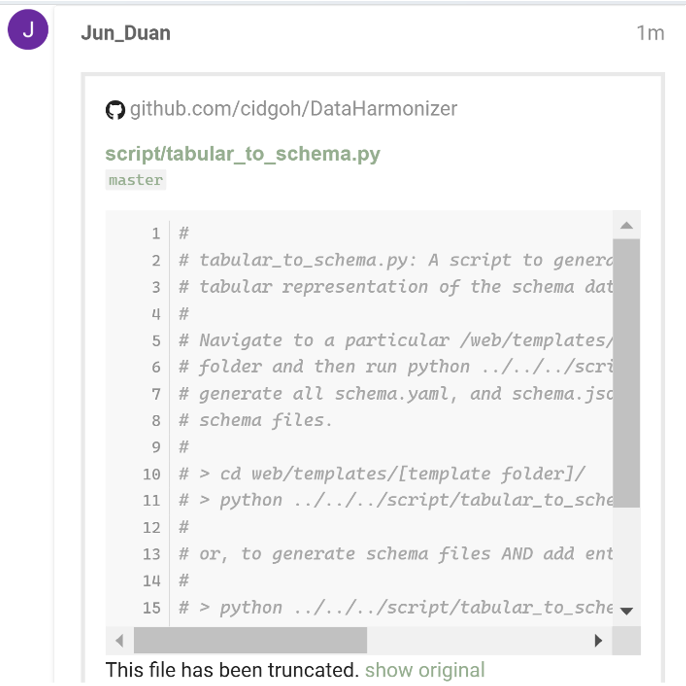

# Citing GitHub Repositories, Issues, and Code in Discourse
{: .no_toc }

## Table of Contents
{: .no_toc .text-delta }

1. TOC
{:toc}

As CS-DCC uses GitHub for code management and issue tracking, you may often need to reference GitHub content. Discourse makes it easy to cite repositories, issues, and specific lines of code — particularly from public repositories.

### Citing a GitHub Repository

- Copy the repository URL from GitHub.
- Paste it directly into your Discourse post.  
   Discourse will automatically embed a preview.

For example, this is a citation for [https://github.com/cidgoh/DataHarmonizer/](https://github.com/cidgoh/DataHarmonizer/)

---

### Citing a GitHub Issue or Pull Request

- Copy the issue or PR URL from GitHub.
- Paste it directly into your post.

For example, this is a citation for an issue [https://github.com/cidgoh/DataHarmonizer/issues/439](https://github.com/cidgoh/DataHarmonizer/issues/439)

---

### Citing Specific Code or Lines

- Open the file in the GitHub repository.
- Click a line number or select a range of lines to highlight.

- Copy the URL from your browser (it includes the line numbers, e.g., https://github.com/cidgoh/DataHarmonizer/blob/master/script/tabular_to_schema.py#L1-L24).
- Paste the URL in your post.

