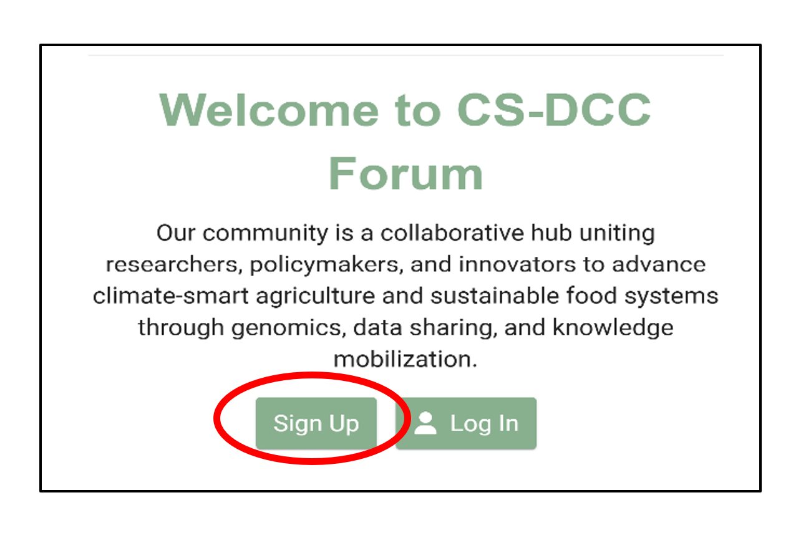
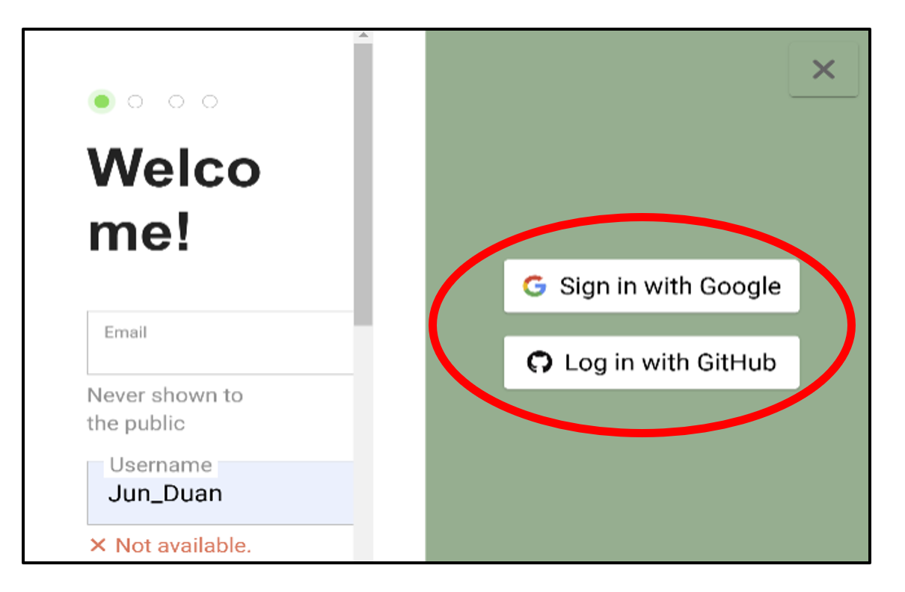
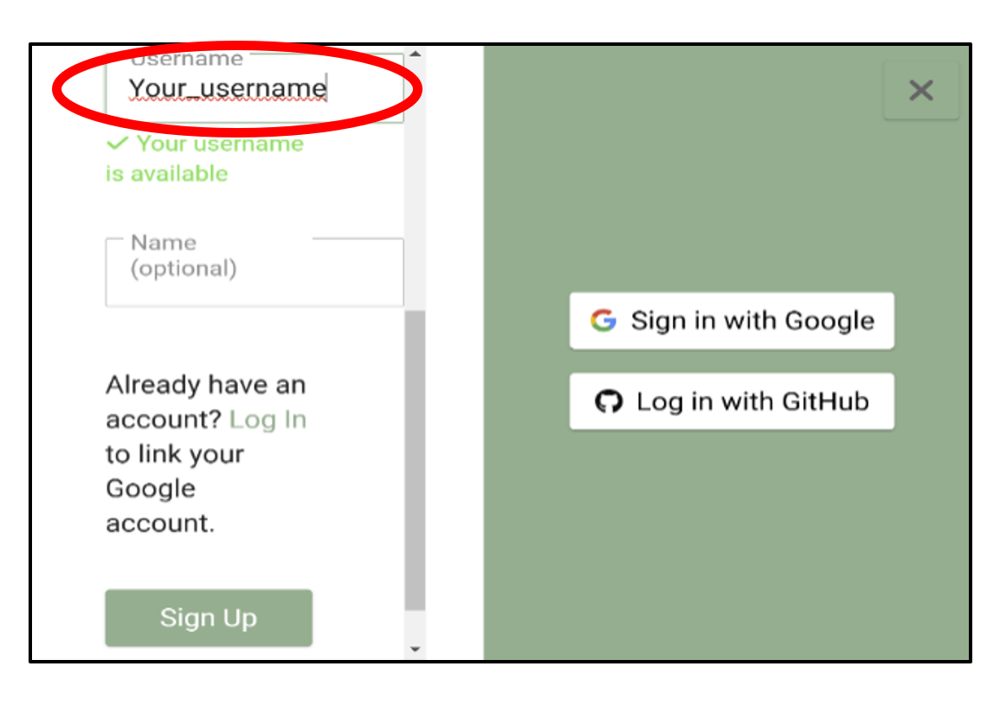
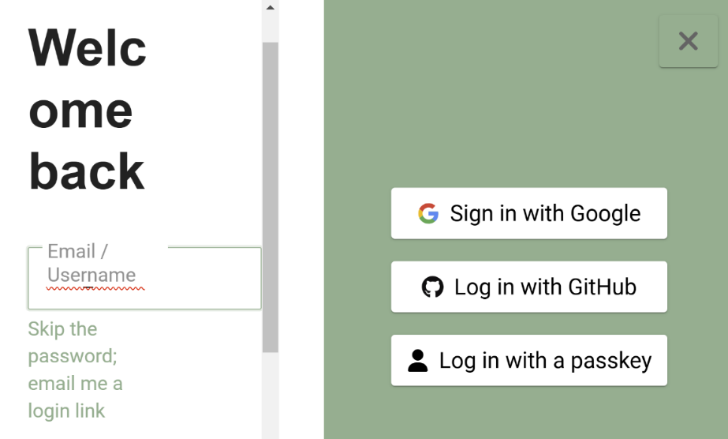
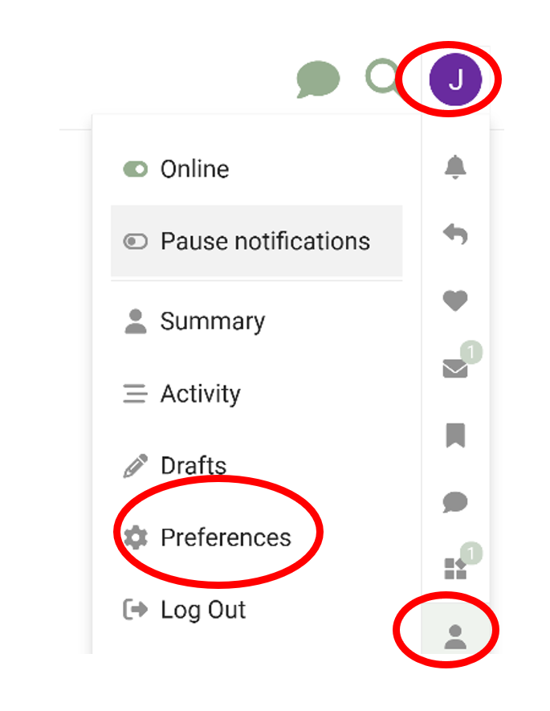

# Getting Started with Your Account
{: .no_toc }

## Table of Contents
{: .no_toc .text-delta }

1. TOC
{:toc}

### Visit the Forum

Go to [https://forum.climatesmartagrifood.ca/](https://forum.climatesmartagrifood.ca/)

### Sign Up (For New Users)

- Click the **Sign Up** button.

- Select **Gmail** or **GitHub** as your sign-up method.

- Once authentication is complete, choose your username and click **Sign Up** to finalize your account.

- Your account will be reviewed by an admin, then you can use the forum once it has been approved.

### Log In (For Existing Users)

- Click the **Log In** button.
- Select **Gmail** or **GitHub** to log in with your approved account.

### Personalize Your Profile

- After logging in, click your **name** in the top-right corner of the page.
- Select **Profile** from the dropdown menu, then click **Preferences**.

Under the **Profile** tab, you can:

- Upload a profile header picture
- Add a short bio to introduce yourself