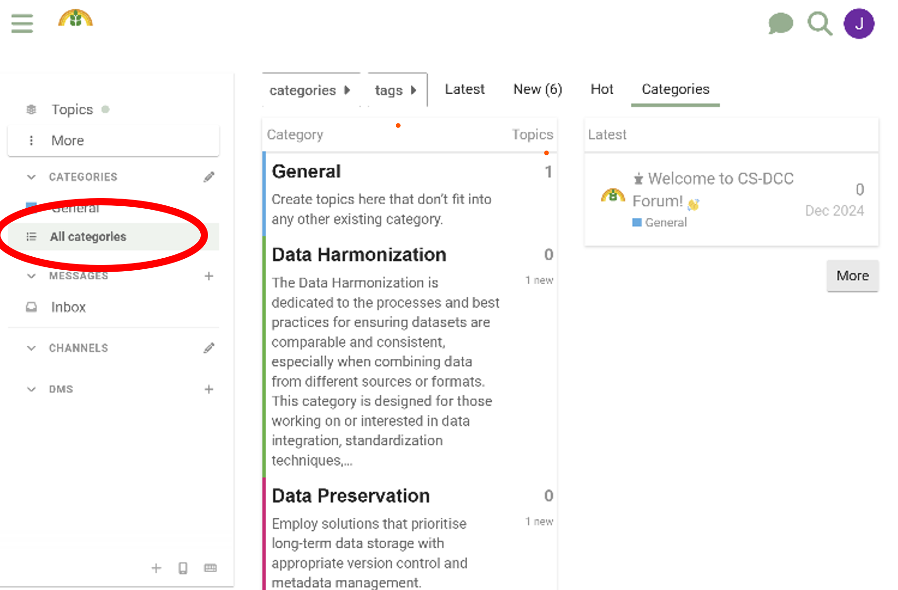
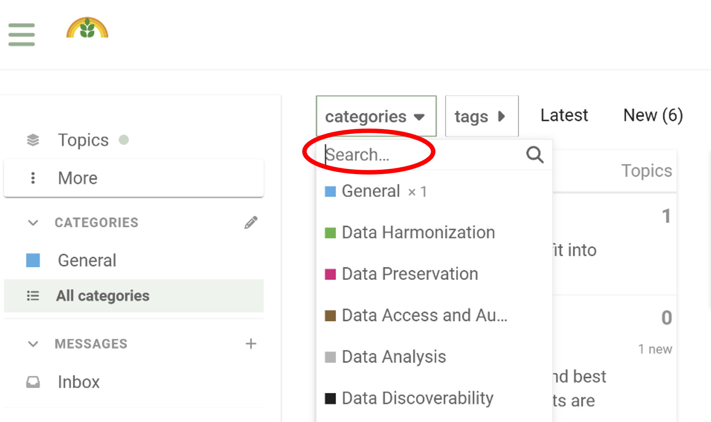
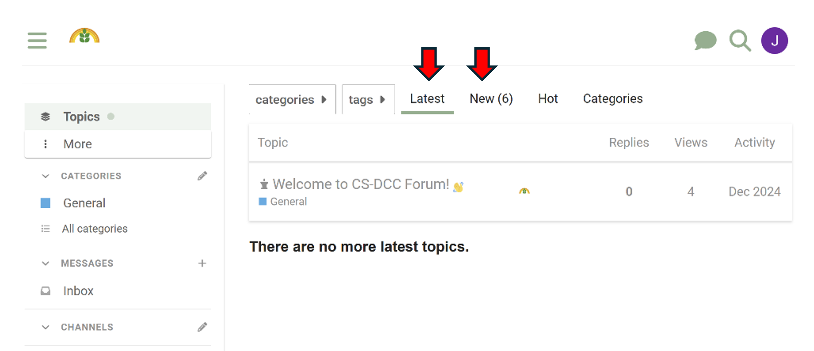

# Navigating the Forum
{: .no_toc }

## Table of Contents
{: .no_toc .text-delta }

1. TOC
{:toc}

### Explore Categories

The forum is organized into categories like **Data Harmonization**, **Data Preservation**, **Data Access**, and **Authentication**, among others. These categories group posts by topics of interest.

- Browse through the posts in each category to find discussions relevant to your interests.

- Alternatively, use the **Search** bar at the top of the page to quickly find specific topics or discussions.

### Latest and Top Posts

- The **Latest** tab displays the most recent posts and activities across all categories.
- The **Top** tab highlights the most popular or highly engaged discussions.

