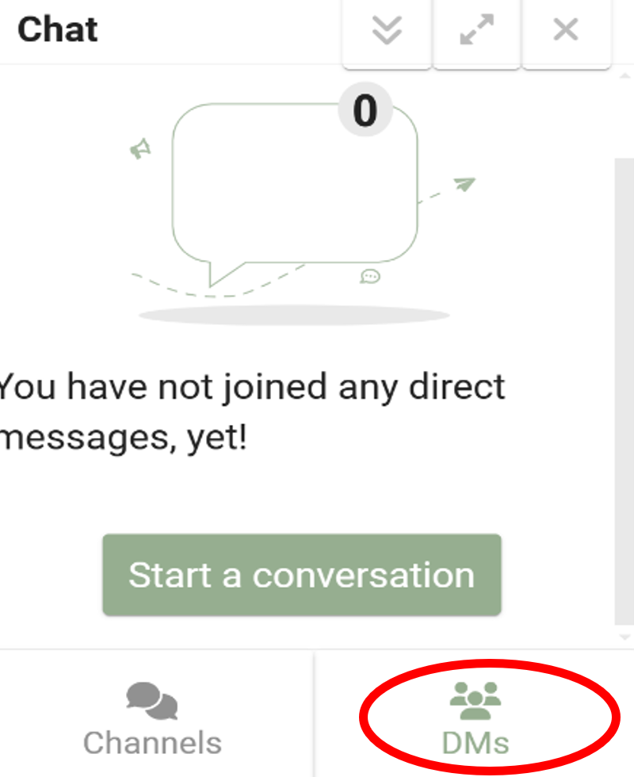
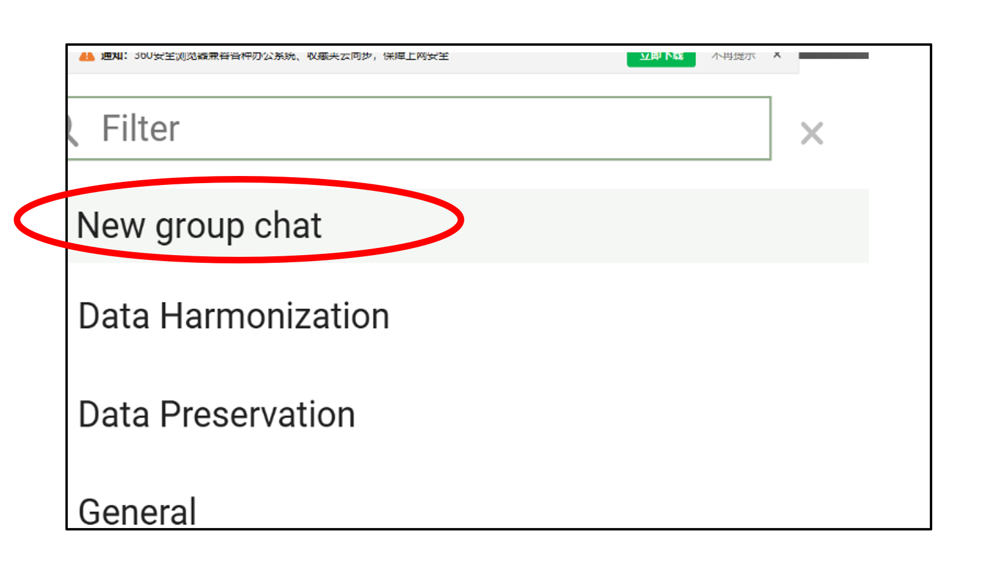
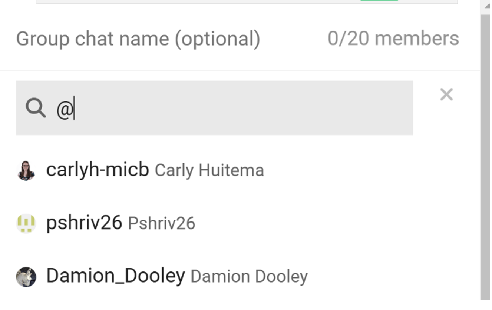

# Participating in Real-Time Discussions via chat
{: .no_toc }

## Table of Contents
{: .no_toc .text-delta }

1. TOC
{:toc}

### Chatting by Channel

Chat channels are dedicated spaces for discussions on specific topics. They function like rooms where members can join and participate in topic-focused conversations.

**To join a channel:**

- Look for the **Chat Icon** (a speech bubble) in the top navigation bar.
- Click on the icon to open the chat interface, which displays a list of available chat channels.

- Select a channel and send your message.

**Tips:** Mention users by typing `@username` to notify them.

---

### Group Chat

Group chats allow you to create or join private conversations with a specific group of users — ideal for team discussions or small group interactions.

- Look for the **Chat Icon** (speech bubble) in the top navigation bar.
- Click on it to open the chat panel.
- In the chat panel, go to the **DMs** tab (Direct Messages).
- Click the **Start a conversation** icon.

- Choose **New Group Chat**.

- Add users to the group chat.

**Tips:**  
- Type a username in the search bar to find specific members.  
- Or type `@` to see a list of users, then click names to add them.

