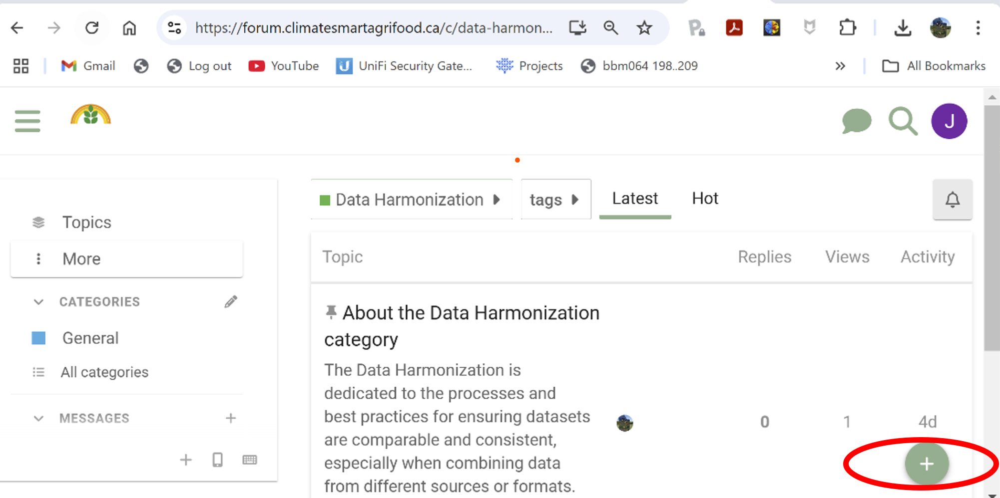
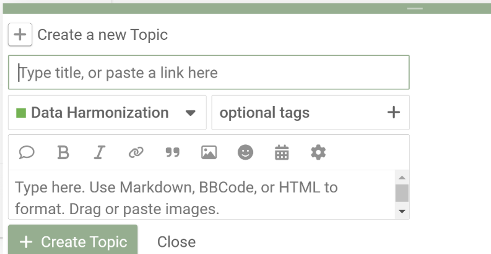
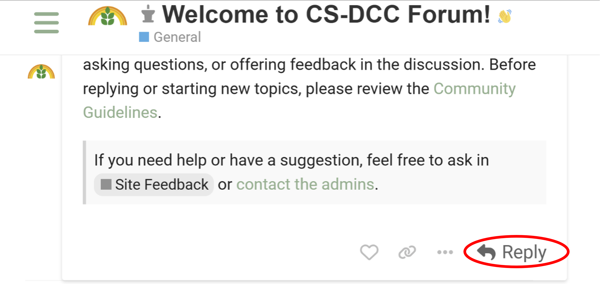

# Participating in Discussions
{: .no_toc }

## Table of Contents
{: .no_toc .text-delta }

1. TOC
{:toc}

### Create a New Topic

To start a new discussion:

- Navigate to the relevant category and click **New Topic**  
   - Browse the forum to find the category that aligns with your topic (e.g., **Data Harmonization**, **Data Preservation**).
- Click **New Topic**

- Add a **Title** and **Content**  
   - Provide a descriptive title that captures the essence of your topic.  
   - Write your post in the provided text box. Use formatting tools to enhance your content.

 **Tip:**

- **Tags** help categorize your topic and make it easier for others to find related discussions. You can add relevant tags when posting your topic. New tags are created the first time they are used.
- You can click the **notification bell** on a topic to set it to **Watching**, **Tracking**, or **Muted**.

---

### How to Reply to Posts

#### Replying Directly on the Platform

- Log into the Discourse platform and navigate to the topic or post you want to reply to.

#### Replying to Posts by Email

- When someone replies to a post you're following, a **notification email** will be sent to you.
- You can simply **reply to the email directly**. After a few minutes, your response will be automatically posted in the Discourse thread.

 **Tip:**

- You can type `@` followed by a username to notify someone (e.g., `@username`).
- You can **attach files or images** to your email reply. These will be uploaded to the thread with your response.
- Basic formatting (like **bold** or *italic*) may be preserved, depending on your email client.

