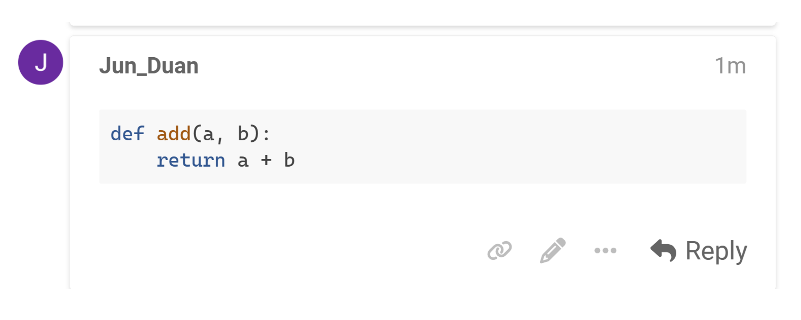

# Using Markdown for Code Snippets
{: .no_toc }

## Table of Contents
{: .no_toc .text-delta }

1. TOC
{:toc}


To display code directly in your post, use Discourse's Markdown syntax:

### Inline Code

To format a short piece of code inline with your text, just wrap the code with single backticks (\`).

For example:

Use the `print()` function to display output.


### Code Blocks

For larger code blocks, use triple backticks (\`\`\`) before and after the code.

For example:


**Tips**: To enable syntax highlighting, specify the language after the opening triple backticks. Discourse supports popular languages like Python, JavaScript, HTML, and more.

For example:

```python
def add(a, b):
    return a + b
```


