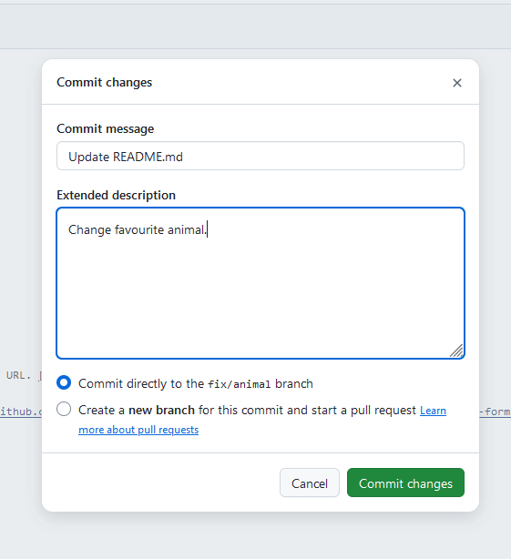
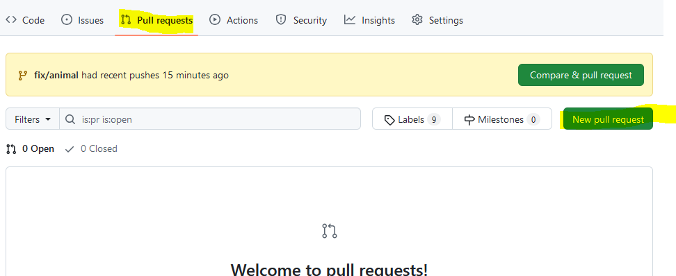
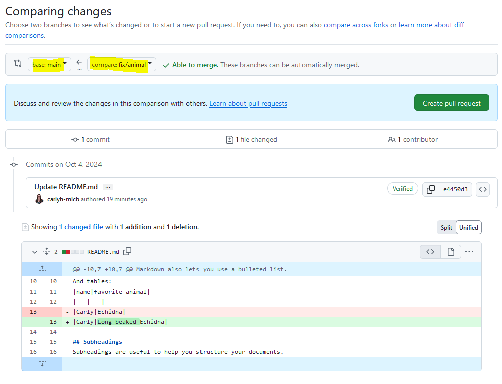
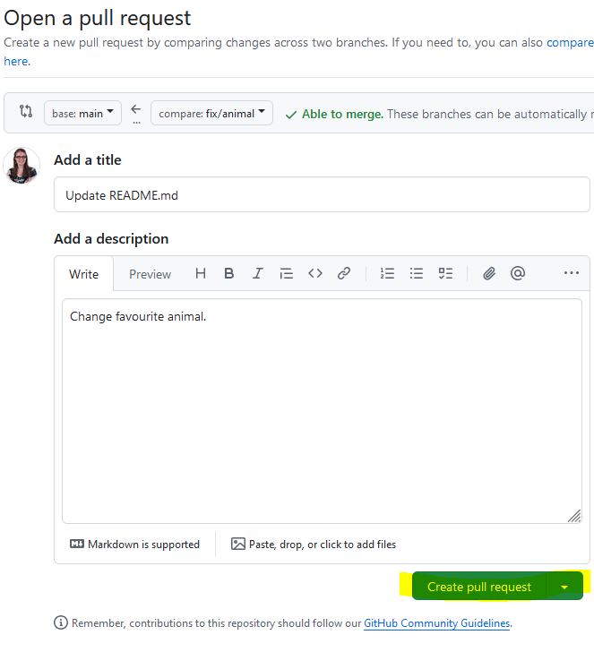
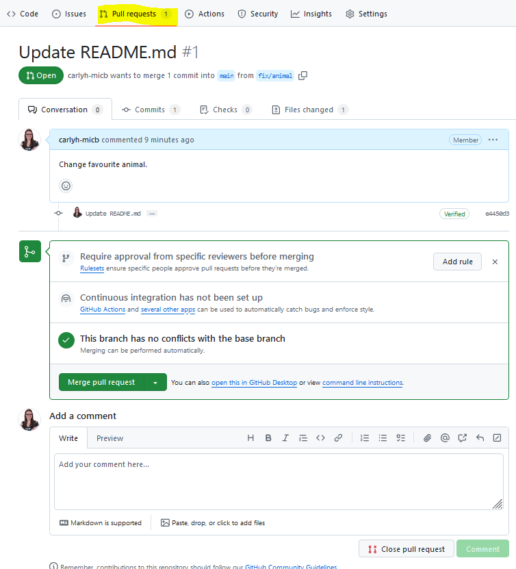
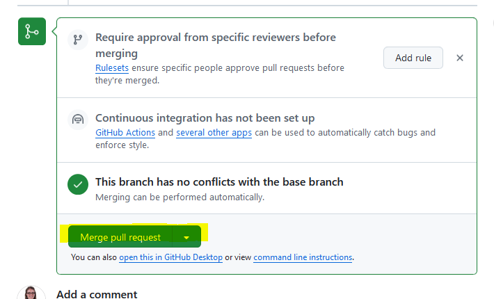
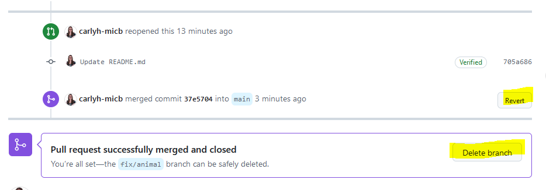

# GitHub Branches
{: .no_toc }

## Table of Contents
{: .no_toc .text-delta }

1. TOC
{:toc}

Branches in GitHub allow teams to work on different versions of documentation simultaneously without affecting the main version. They enable experimentation, content updates, or large revisions in isolation. Once changes are finalized and reviewed, they can be merged into the main branch, ensuring the primary documentation remains stable while updates are developed. This approach supports collaboration, version control, and smoother integration of changes.

## A Scenario with Branching

Consider this scenario and then read on to learn the details: You are collaborating on developing a standard (such as a controlled vocabulary). Your group has released one version already and you are working on the next release which is on its own 'next release' branch. To make your edits, first you create your editing branch from this next release branch and make the changes. You commit your changes to your branch, and then you put in a Pull Request (PR) to have your changes accepted in the next release branch. At the next scheduled review, your group goes through all the PRs, reading the descriptions, looking at the changes and deciding if they will accept the changes or send the work back with comments. Your changes are accepted and your branch is merged into the next release branch. When the next release branch is finalized, you will release the next version of your controlled vocabulary from this work.

## Branch Names

Deciding on branch naming conventions can make it much easier to manage your work. For example, decide on a few categories of branch names (e.g. fix, new, feature etc.) and use them as terms for the start of your branch name. Separate your branch category from the details with a /. e.g. fix/animal would be a branch name.

## Make a Branch

After deciding on the name for your branch it is time to create it. One way to create it is to click on the branch button, type in your new name and select "Create branch fix/animal from main". See the image below for the example.

After you have created a branch you can find it, and others back on the branch button. In the above example the branch was made from main, but if you were working on a new release (e.g. branch release/v2), your branch could be off this next release branch instead.

If you are working in GitHub and can't find the changes you were sure you were making, be sure to check which branch you are currently on!

## Edit Files in a Branch

After checking which branch you are on, you can go in and make changes in the files. When you are finished making changes you will `Commit changes...` as before. Add your commit message and description and verify that you are adding your commit to the correct branch before Commiting your changes. In this window you can also see that you could create a new branch instead. This is another way to make a branch - make changes first and then Commit to a new branch.

After you have committed the changes you can compare the changes by switching branches. You can verify that your new changes are limited to the current branch you are on.

## Raise a Pull Request

* A **Pull Request** is a formal request to merge changes from one branch (such as fix/animal in our example) into another branch (often the main or master branch or release/v2 in our example). _Purpose_: To propose, review, and discuss changes before they are merged into the main codebase. It allows other team members to review your code, comment on it, and request changes if necessary.

To merge your changes you need to perform a Pull Request (or PR) in GitHub. You don't push your changes onto the other branch, you request to have your changes pulled in.

Click on `Pull requests` and create a `New pull request`.

Now you will pick which branch you want to merge into the host branch (in this example merging from branch fix/animal into branch main). Below you will see all the changes between the two which helps you decide if this is the PR you want to generate. Select `Create pull request`.

While you have been making notes about each commit you do all along, when it comes ot the PR it is time to write your summary comments to the PR. Writing a good PR will help the community (or you) understand exactly what you were doing and why. Select `Create pull request`.

Now you have created your pull request (assuming you have no conflicts which we will talk about later). You can stop here and your pull request has been added to the queue of PRs. You might want to stop here because this is a good time for someone else to review your writing/code. Especially if you are collaborating on documents, when it comes time to merge with one of the more important branches (like your main branch or a release branch) your community may want to come together to review PRs, make decisions if they should be merged or returned with comments for more revisions before merging.

If you make more commits to a branch after a PR has been made, those later commits also get added to the PR. If you want to save new changes and you don't want them to be added to the open PR you will need to create a new branch.

## Review a Pull Request

If you are working collaboratively on a project you will want to review PRs and leave comments. If you don't accept a PR and think that more changes are needed you can make those comments and select `Close with comment`.

Branches can be futher developed, PRs can be reopened and reassesed and eventually a PR will be accepted.

## Merge a Pull Request

Once you have decided to accept all the changes in a PR you can merge the pull request (and confirm the merge). 

Once a branch has been merged you can may choose to delete the source branch (for example delete the fix/animal branch). The changes have been added to the main branch and deleting completed branches helps keep the project clear and tidy. If you've made a mistake, you can also revert the merge. This doesn't delete all the changes in your commit history, but it replays backwards the changes you made and you can undo the merge.

## Merge Conflicts

Merge conflicts happen when you try to merge branches that have competing commits, for example if two people try to change the same line of the file. The GitHub official documentation site has an excellent review of [how to resolve merge conflicts](https://docs.github.com/en/pull-requests/collaborating-with-pull-requests/addressing-merge-conflicts/resolving-a-merge-conflict-on-github). 

## Forking

What happens if are contributing to a standard/documentation repository but you don't have permissions to work in that repository? What you do is create a fork of the repository and keep it in your personal repository (or an organization you are a member of). Then you make changes there and you can make Pull Requests from your repository to the source (aka upstream) repository. Read the details on the [GitHub documentation site](https://docs.github.com/en/pull-requests/collaborating-with-pull-requests/working-with-forks/about-forks).

## Summary

Now you have the tools to work collaboratively on the shared project using GitHub. Whether it is code or documentation GitHub lets you create branches to explore work, raise PRs to merge your work back and ultimately merge your work into the ongoing projects official branches. If you are working by yourself you won't need to wait for approval before merging. Without adding branch protection rules (not covered in this tutorial) you'll see that you can raise PRs and merge without waiting for approval. With GitHub all change are recorded in the commit record so you will always be able to go and see who made changes and what those changes were.

## Further Resources

Those looking for a deep dive into GitHub branching models can read [A successful Git branching model](https://nvie.com/posts/a-successful-git-branching-model/) which has a code focus but could be relevant to documentation projects as well (where bugs=typos for example).

More details on collaborating with GitHub can be found at the [OBO Semantic Engineering Training](https://oboacademy.github.io/obook/tutorial/github-fundamentals/) documentation site.

- written by Carly Huitema

