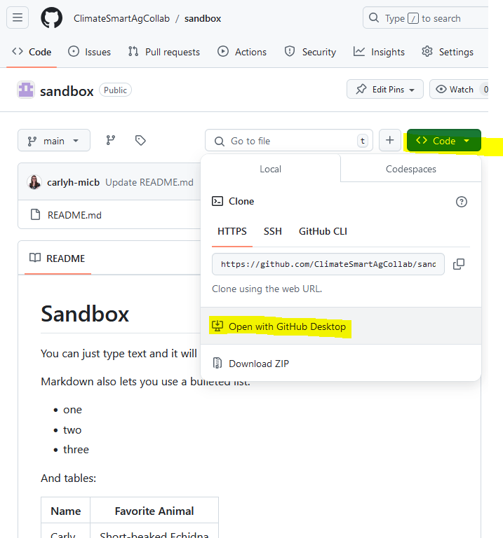
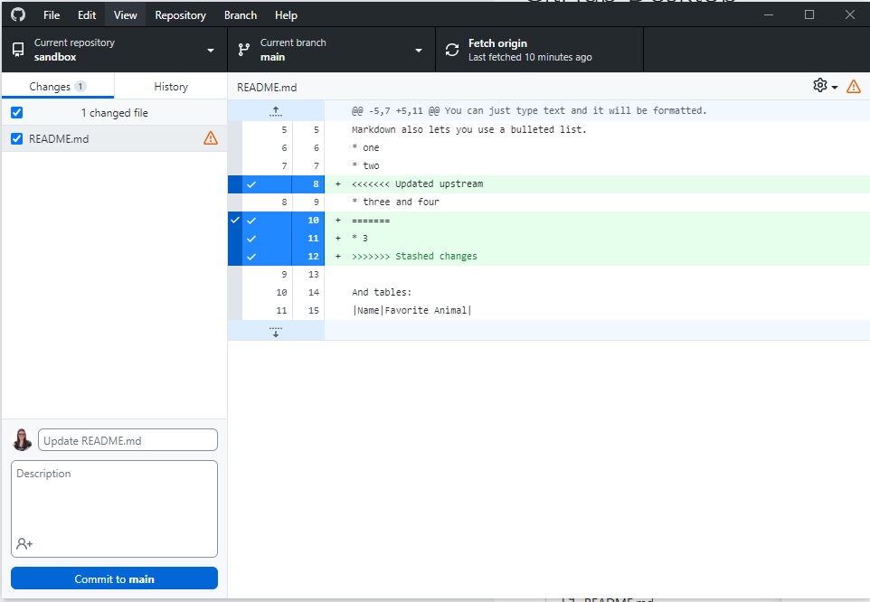

# GitHub Desktop
{: .no_toc }

## Table of Contents
{: .no_toc .text-delta }

1. TOC
{:toc}

GitHub Desktop helps you copy your repository contents onto your computer. This is relevant when you want to run the code on your computer for analysis, or if you want to use a text editor on your computer because the web editor of the GitHub webpage isn't sufficient. You use GitHub Desktop to keep your local version in sync with the GitHub version of the respository.

First you need to [install GitHub desktop (available for Windows and MacOS)](https://docs.github.com/en/desktop/installing-and-authenticating-to-github-desktop/installing-github-desktop).

## Link a Repository

On the web, navigate to your GitHub repository that you want to open with GitHub Desktop. From the `<> Code` button, select `Open with GitHub Desktop`. You will begin the process of cloning the repository locally on your computer. The GitHub repository you cloned is the origin, it is upstream of your local version and is considered remote. The repository on your computer is your local version.

.

Linking to a repository will create a GitHub folder on your computer that holds the repository contents. You can go into this folder and run code, view documents, edit contents and save your results. Saving your results is not the same thing as committing. When you use GitHub Desktop you will need to do both: save your files, and then commit (locally) your changes. When you are happy with your work you will Push your changes back up to the origin.

## Pushing, Pulling and Pull Requests

We first experienced Pull Requests when we discussed using branches in GitHub and merging branches. With the introduction of working locally we now introduce the concepts of pushing and pulling. Pushing and pulling in GitHub are different from creating a Pull Request (PR), though they are all part of the Git workflow. Here’s a breakdown:

### Pushing and Pulling:

* **Pulling**: This action retrieves the latest changes from the remote repository (origin) and integrates them into your local branch. This can be done with or without your own changes being present in the branch. _Purpose_: To update your local copy with the latest commits made by others.
* **Pushing**: This action sends the changes (commits) you made locally to the remote repository (origin), updating it with your new work. _Purpose_: To share your changes with others by making them available on the remote repository.

Pushing and pulling are direct interactions between your local repository and the remote repository (origin).

### Pull Request (PR):

* A **Pull Request** is a formal request to merge changes from one branch (typically a feature or development branch) into another branch (often the main or master branch). _Purpose_: To propose, review, and discuss changes before they are merged into the main codebase. It allows other team members to review your code, comment on it, and request changes if necessary.

{: .important-title }
> Push and Pull vs Pull Request
>
> Pushing and pulling deal with syncing changes between your local repository and the remote repository.
>
> Pull Requests involve requesting a merge of changes from one branch into another and are typically used for code reviews, discussion, and collaboration before final integration.

While you often push changes before creating a PR, the PR process adds a layer of collaboration and review that pushing and pulling alone do not provide.

## Working locally

Every time you start working you should confirm which repository and branch you are working on, and then Fetch Origin - this pulls all the latest changes to your working branch into GitHub Desktop. If someone has made changes upstream in the GitHub repo itself (the origin), and if you have made changes to files but haven't pushed your changes upstream to the origin you may have to resolve some conflicts.

Frequently fetching the origin means your local copy of the repository is up to date with any changes that may have been made by others or from other branches. If someone has pushed changes to the remote repository, you’ll be aware of these changes before starting your work.

By fetching and pulling the latest changes, you reduce the risk of merge conflicts later. If your local changes conflict with the newly fetched remote changes, it's better to resolve them before you begin working rather than after you've made additional changes.

## Saving and Commiting

After you have saved your files on your computer, it is time to commit your files within GitHub Desktop. The commit becomes part of the _version history_ in your local repository. You can later revert back to this commit if needed or compare it to other commits.

The changes are saved **only** in your **local Git repository** (on your computer). This commit is not yet shared with others, as it remains local until you push it to the remote repository (origin).

{: .important }
Committing locally in GitHub Desktop **saves a snapshot of your changes** in your local repository, but the changes remain private to your computer until you push them to the remote repository.

## Next Steps After Local Commit
- **Push to Remote**: Once the files are committed locally, you can _push_ them to the remote repository on GitHub (origin) to share the changes with others.
- **Pull Requests**: If you’re working on a branch and are ready to propose changes to another branch (e.g., `main`), you might create a _Pull Request_ after pushing.

- written by Carly Huitema
