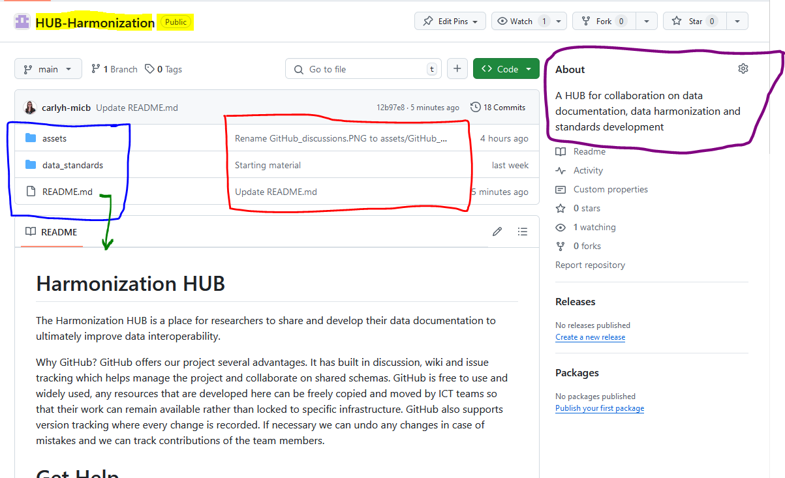
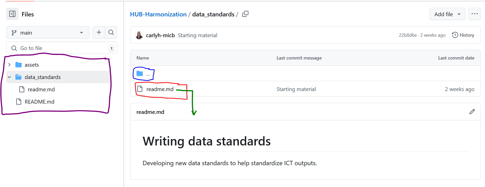
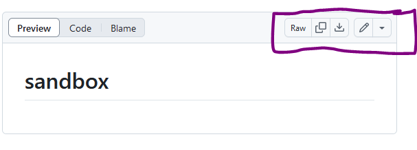
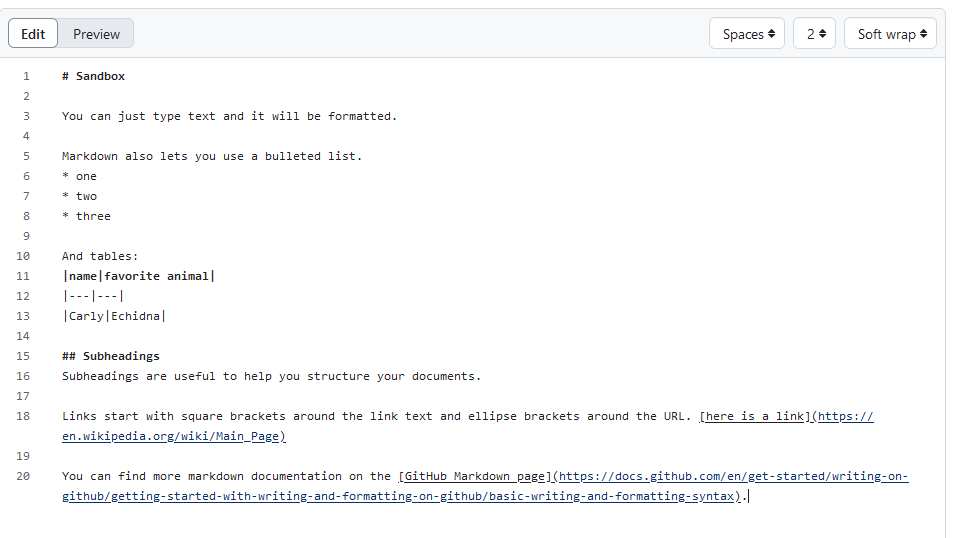
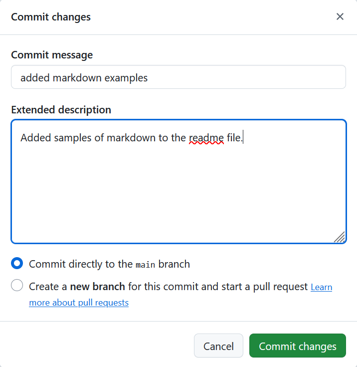

# Introduction to a GitHub Repository
{: .no_toc }

## Table of Contents
{: .no_toc .text-delta }

1. TOC
{:toc}

Begin to learn about using GitHub here.

## Wayfinding and Navigation

A GitHub repository is where you can store all the assets of a project. GitHub is extremely good at handling version control of text files. Typically GitHub is used for code management, but GitHub can also be very useful for managing the development of standards.

Because GitHub is so often used by coders, help material is typically written by developers for developers.

This guide is written for people who are typically not coders but want to benefit from some of the great features GitHub can offer.

Below is an example of a GitHub Repository. A repository typically contains all the files related to a project. For people writing and sharing data standards (or ontologies or other text-based documents), a repository could hold the information for a data standard.

The name of this repository pictured above is called HUB-Harmonization. It is a public repository which means that anyone on the web can see it, but only people with permission will be able to edit it.

In the purple box is a description written by the owner of the repository which describes what is in the repository.

In the blue box are highlighted folders/directories and files that belong in the repository. Beside them in the red box are notes made by the last person who edited the file or folder.

Typically in the files of a repository is a file called README.md. GitHub recognizes that a readme file is special and will show the contents of the readme file by default in the area below (pointed to by the green arrow).

If you click on the folder `data_standards` you can see what documents have been added to this folder.

After clicking on `data_standards` you enter the files view where you can navigate the contents of the repository. In the folder/directory `data_standards` there is another readme.md (red box), which is recognized by GitHub and the contents shown by default below (green arrow). 

On the left is the file navigation (purple box) where you can navigate the structure of the repository. In the blue box is a folder with two dots `..` where clicking on this will move you up one folder/directory.

## Writing and saving in GitHub using the webpage

The easiest way to work with GitHub is to do all your editing directly in the webpage. Lots of helpful pages on the internet talk about Git CLI (Command Line Interface) or GitHub desktop, but all kinds of progress can be made in GitHub just through the web interface.

In the [Sandbox repository](https://github.com/ClimateSmartAgCollab/sandbox) of the ClimateSmartAgCollab organization, or in your own personal repository you can edit the readme.md markdown file.

In the purple box, from left to right, Raw=look at the raw code not the nicely formatted version you are currently seeing, two boxes=copy, down-arrow=download the file and the pencil lets you edit the file.

Click on the pencil icon to begin editing the readme markdown file directly in your web browser.

Here you can find some text written in Markdown. If you click on the preview button you can preview how the markdown will be formatted. Try to add your name and favorite animal to the table. If the table isn't there, look at how it is written in the picture above and recreate it.

You can learn more about writing in markdown on the [GitHub Markdown page](https://docs.github.com/en/get-started/writing-on-github/getting-started-with-writing-and-formatting-on-github/basic-writing-and-formatting-syntax).

### Saving in GitHub webpage
Finally, how do you Save your results in GitHub?

In the web interface, the green `Commit Changes...` button performs the function of saving your work. Clicking on the `Commit Changes...` button pulls up the Commit Changes box (pictured below).

Because GitHub is such a collaborative environment, when you Commit Changes, you can write messages to the community about what changes you made and any reasoning. Sometimes if you need to undo work it can be very helpful to have good commit messages and descriptions. In an even more formalized environment of development where commits must be reviewed before being accepted (e.g. when developing an official standard) good commit messages can help the approval process.

After you have written your message and description you will Commit directly to the main branch. You can accomplish a lot in GitHub only ever using the Main branch. Branches are a great tool when you want to have your main, official document on Main, and you can create branches when you want to work on the next version before it becomes official.

Commit your changes directly to the main brance and press the green button `Commit Changes` to save your work in GitHub. Now you and everyone else with access to the repository can view your work.

## Creating new files and folders in GitHub webpage

On the main code page of GitHub (click on <>Code at the top of the page to get there) you can add files either by creating a new file (a new text file) or by uploading a file. Give your new file a name in the "Name your file..." box and a filename extensions (e.g. .md for a markdown file).

In the "Name your file..." box you can also change what folder you want your new file to be in. If you want your new `filename.seq` file to be in a folder/directory called "sequences", type `sequences/filename.seq`. As you type the forward slash / you will automatically create the new folder/directory.

Oops, maybe you mispelled your folder name, how do you undo it? You can backspace from the beginning of the filename, or type `../` into the "Name your file..." box (remember the double dots `..` means go up a directory),and you will go up one folder level and now you can type your folder name correctly. 

If you uploaded a picture and you want to put it in the pictures folder you have to wait until after it is uploaded. Then, click on the pencil icon to edit the file. You can't edit the image file directly because it is a binary file, but you can change the name. Add to the front of your filename `images/` and you will put your file in a new images directory.

- written by Carly Huitema
